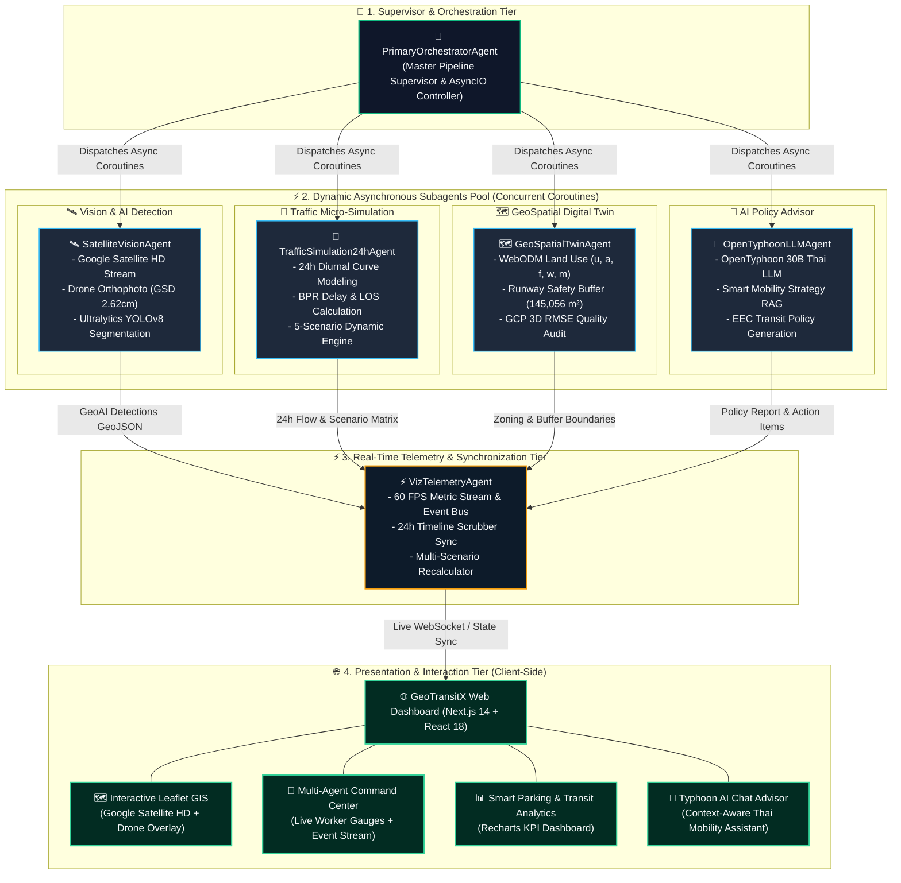

# 🛰️ GeoTransitX: Predictive Traffic & Smart Transit AI Platform
### ระบบแบบจำลองการจราจร 24 ชม. บนแผนที่ดาวเทียมจริง Google Satellite HD & สถาปัตยกรรม Asynchronous Multi-Agent

<p align="center">
  <a href="https://geotransitx.vercel.app/">
    
  </a>
  
  
  
  
</p>

---

## 🌐 เว็บแอปพลิเคชันจริง (Live Production)
* 🚀 **Production URL**: [https://geotransitx.vercel.app/](https://geotransitx.vercel.app/)
* 📍 **พื้นที่สำรวจนำร่อง**: สนามบินบางพระ (Bang Phra Airport), จ.ชลบุรี — ระเบียงเศรษฐกิจพิเศษภาคตะวันออก (EEC)
* 🎯 **GCP Project ID**: `geoai-506806` | **Project No**: `334457340669`

---

## 🌟 ฟีเจอร์เด่นของระบบ (Key Capabilities)

### 1. 🛰️ แบบจำลองการจราจร 24 ชม. บนแผนที่ Google Satellite HD จริง (สายฟรี 100%)
* **Interactive Leaflet Sat Engine**: ผสานภาพถ่ายดาวเทียมความละเอียดสูง **Google Satellite HD** (`https://mt0.google.com/vt/lyrs=s&x={x}&y={y}&z={z}`) และ **Google Hybrid** (`lyrs=y`) แบบฟรีไม่ต้องใช้ API Key
* **Dynamic Vehicle Movement**: จำลองการเคลื่อนที่ของยานพาหนะตามพิกัดถนนจริง WGS84 อย่างสมจริง (🚗 รถยนต์ส่วนบุคคล, 🚌 รถโดยสารสาธารณะ EEC, 🚚 รถบรรทุกโลจิสติกส์, ✈️ อากาศยานฝึกบินบน Apron/Runway, ⚡ รถชัตเติลบัสไฟฟ้า EV Feeder)
* **24-Hour Timeline Scrubber & Speed Controls**: ควบคุมช่วงเวลาได้ 48 ช่วงเวลา (00:00 - 23:30 น.) พร้อมปุ่มเล่น/พัก, ปรับความเร็ว 1x, 2x, 5x, 10x และปุ่มลัดสู่ช่วงเวลาสำคัญ (02:00 กลางคืน, 08:00 Peak เช้า 860 vph, 12:30 ขนส่งการบิน, 17:30 Peak เย็น 940 vph)
* **Telemetry HUD**: แสดงปริมาณจราจร (vph), ความเร็วเฉลี่ย (กม./ชม.), ดีเลย์สะสม (วินาที), ระดับ LOS (A-F), การปล่อย CO2 (kg/h) และแจ้งเตือนความปลอดภัยเขต Runway Buffer (145,056 ตร.ม.)

---

### 2. ⚡ ระบบจำลอง 5 สถานการณ์พิเศษ (Scenario Simulation Engine)
สามารถเลือกเปลี่ยนสถานการณ์จำลองและระบบจะคำนวณผลกระทบต่อเครือข่ายจราจรแบบ Real-Time:
1. ☀️ **วันทำงานปกติ (Baseline Flow)**: การไหลเวียนปกติในวันทำการ ปริมาณจราจร 5,420 คัน/วัน
2. 🌧️ **ฝนตกหนักและน้ำท่วมขัง (Monsoon Surge)**: ความเร็วลดลง 42%, ดีเลย์พุ่ง +115%, เกิดวิกฤต LOS E/F
3. ✈️ **งานนิทรรศการการบิน EEC (Airshow Peak)**: ปริมาณจราจรพุ่งสูง 185%, ลานจอดและ Apron หนาแน่นสูงสุด
4. 🚧 **ปิดซ่อมบำรุง Runway / ผิวทาง (Maintenance)**: บีบช่องจราจรเหลือ 1 เลน เกิดคอขวดและแจ้งเตือนความปลอดภัย
5. ⚡ **ระบบขนส่งไฟฟ้า Smart EV Feeder (Green Mobility)**: รถบัสไฟฟ้าเชื่อมต่อ EEC ลดคาร์บอนลง 65% ความเร็วเพิ่มขึ้น 15%

---

### 3. 🤖 สถาปัตยกรรม Primary Agent & Dynamic Asynchronous Subagents
ระบบทำงานด้วยสถาปัตยกรรม **Primary Supervisor + Concurrent Subagents** ที่ประมวลผลคู่ขนานแบบ Asynchronous:
* 👑 **`PrimaryOrchestratorAgent`**: ผู้ควบคุมหลักและจัดการคิว AsyncIO Coroutines
* 🛰️ **`SatelliteVisionAgent`**: ประมวลผลภาพดาวเทียม Google Sat HD + Drone Orthophoto & YOLOv8 Segmentation
* 🚦 **`TrafficSimulation24hAgent`**: คำนวณแบบจำลองจราจร 24 ชม. และสมการความล่าช้า BPR (Bureau of Public Roads)
* 🗺️ **`GeoSpatialTwinAgent`**: บริหารจัดการ Digital Twin, ผัง Land Use (u, a, f, w, m) และจุดควบคุม GCP (RMS 1.3 ซม.)
* 🤖 **`OpenTyphoonLLMAgent`**: สังเคราะห์นโยบาย Smart Transit ภาษาไทยด้วย OpenTyphoon 30B
* ⚡ **`VizTelemetryAgent`**: สตรีมข้อมูล Telemetry เชื่อมโยงกับ Scrubber และแผนที่ 60 FPS
* **Multi-Agent Command Center Hub**: แผงควบคุมสดบนเว็บแสดงสถานะ Latency, Throughput (fps), CPU %, และปุ่มสั่ง Dynamic Re-Simulation พร้อม Live Event Stream

---

### 4. 📸 ข้อมูลภาพถ่ายโดรนความแม่นยำสูง (WebODM Photogrammetry)
* **พื้นที่สำรวจ**: 60,395 ตร.ม. (สนามบินบางพระ จ.ชลบุรี)
* **ความละเอียดภาพ (GSD)**: 2.62 ซม./พิกเซล
* **ความแม่นยำ 3D GCP RMS Error**: 0.013 ม. (1.3 ซม.)
* **ความหนาแน่น Point Cloud**: 10.5 ล้านจุด (Dense 3D Mesh)
* **เขตความปลอดภัยทางวิ่ง (Runway Buffer)**: 145,056 ตร.ม. (ตามมาตรฐาน ICAO Annex 14)

---

## 🏛️ ผังโครงสร้างสถาปัตยกรรมระบบ (System Architecture)

ระบบ GeoTransitX ได้รับการออกแบบภายใต้สถาปัตยกรรม **Hierarchical Multi-Agent System (HMAS)** โดยแบ่งชั้นการทำงานออกเป็น 4 ระดับ (Tiers) เชื่อมโยงกันด้วย **Non-Blocking Asynchronous Event Bus**:



### 📋 รายละเอียดการทำงานของแต่ละ Subagent (Subagent Matrix)

| Subagent Name | หน้าที่หลัก (Primary Responsibility) | เทคโนโลยี / โมเดล (Tech Stack) | รูปแบบการทำงาน (Execution Mode) | Latency เฉลี่ย | ผลลัพธ์ที่ส่งมอบ (Artifacts) |
| :--- | :--- | :--- | :--- | :---: | :--- |
| **👑 PrimaryOrchestrator** | ควบคุม Workflow, จัดการ Coroutine และตรวจสอบความถูกต้อง | Python AsyncIO, ThreadPool | Master Supervisor | 15 ms | `orchestrator_status.json` |
| **🛰️ SatelliteVision** | ดึงภาพดาวเทียม Google Sat HD, ตรวจจับและแบ่งส่วนวัตถุ | YOLOv8 Seg, OpenCV, PIL | Async Worker Pool | ~340 ms | `detections.geojson` (30 รายการ) |
| **🚦 TrafficSimulation24h** | จำลองการไหลเวียนจราจร 24 ชม., คอขวด และ 5 สถานการณ์ | BPR Stochastic Equations | Concurrent Coroutine | ~185 ms | `traffic_simulation.json` (48 สเต็ป) |
| **🗺️ GeoSpatialTwin** | บริหารผังที่ดิน, จุดควบคุม GCP 3D, และแนวเขต Runway Buffer | WebODM, Shapely, PyProj | Async Spatial Engine | ~110 ms | `land_use.geojson`, `runway_buffer.geojson` |
| **🤖 OpenTyphoonLLM** | สังเคราะห์นโยบายขนส่งอัจฉริยะและมาตรการเชิงพื้นที่ภาษาไทย | OpenTyphoon 30B (Instruct) | Async REST Stream | ~820 ms | `policy_report.json`, `policy_report.md` |
| **⚡ VizTelemetry** | สตรีม Telemetry 60 FPS ซิงค์กับ Leaflet & Timeline Scrubber | React Hooks, Web Workers | Real-Time Sync Engine | ~15 ms | Dynamic State & Map Sync |

---

## 📊 ตารางเปรียบเทียบผลการจำลอง 5 สถานการณ์ (Scenario Benchmarks)

| สถานการณ์จำลอง (Scenario) | ปริมาณจราจร Peak (vph) | ความเร็วเฉลี่ย (km/h) | ดีเลย์สะสม (วินาที) | ระดับ LOS | การปล่อย CO2 (kg/h) | สถานะความปลอดภัย Runway Buffer |
| :--- | :---: | :---: | :---: | :---: | :---: | :---: |
| ☀️ **วันทำงานปกติ (Normal)** | 940 | 36.4 | 142 | **LOS D** | 169.2 | ปลอดภัย (มีระบบเฝ้าระวัง) |
| 🌧️ **ฝนตกหนัก (Monsoon)** | 865 | 21.1 | 305 | **LOS E/F** | 228.4 | เฝ้าระวังพิเศษ (ผิวทางลื่น) |
| ✈️ **งานการบิน (Airshow)** | 1,739 | 23.6 | 340 | **LOS E/F** | 321.5 | มีกิจกรรมภาคพื้นหนาแน่น |
| 🚧 **ปิดซ่อมทาง (Maintenance)** | 799 | 18.2 | 369 | **LOS F** | 245.3 | ⚠️ มีการรุกล้ำแนวเขตก่อสร้าง |
| ⚡ **ขนส่งไฟฟ้า (Green EV)** | 733 | 41.8 | 85 | **LOS A/B** | 59.2 | ปลอดภัยสูงสุด (Zero Emission) |

---

## 🚀 การติดตั้งและรันในเครื่อง (Local Setup Guide)

### 1. ความต้องการของระบบ (Prerequisites)
ก่อนเริ่มต้นติดตั้ง กรุณาตรวจสอบว่าเครื่องของคุณมีโปรแกรมต่อไปนี้:
* **Node.js**: เวอร์ชั่น `v18.17.0` หรือใหม่กว่า (แนะนำ Node.js LTS)
* **Python**: เวอร์ชั่น `3.10` หรือใหม่กว่า (แนะนำ Python 3.12)
* **Git**: สำหรับการโคลนคลังโค้ด
* **OS**: รองรับทั้ง Windows, macOS และ Linux

---

### 2. ดาวน์โหลดโค้ดและโครงสร้างโปรเจกต์ (Clone Repository)
```bash
# โคลนคลังข้อมูลจาก GitHub
git clone https://github.com/kchayta32/GeoTransitX.git

# เข้าสู่โฟลเดอร์โปรเจกต์
cd GeoTransitX
```

---

### 3. ติดตั้งและรันส่วนเว็บ Dashboard (Frontend - Next.js 14)

```bash
# 1. เข้าสู่โฟลเดอร์ web
cd web

# 2. ติดตั้ง Node dependencies
npm install

# 3. ตั้งค่า Environment Variables (ถ้าต้องการปรับแต่ง)
# ไฟล์ .env.local (มี Default พร้อมรันได้ทันที)
# TYPHOON_API_KEY=sk-xxxx

# 4. รัน Development Server
npm run dev
```

🌐 เปิดเบราว์เซอร์และเข้าไปที่: **`http://localhost:3000`**

---

### 4. ติดตั้งและรันระบบ AI Multi-Agent & Backend API (Python 3.12)

เปิด Terminal หน้าต่างใหม่และรันคำสั่งต่อไปนี้:

```bash
# 1. เข้าสู่ Root Directory ของโปรเจกต์
cd GeoTransitX

# 2. (แนะนำ) สร้างและเปิดใช้งาน Virtual Environment
python -m venv venv

# บน Windows:
venv\Scripts\activate
# บน macOS / Linux:
# source venv/bin/activate

# 3. ติดตั้ง Python Dependencies
pip install ultralytics pillow fastapi uvicorn requests pydantic numpy

# 4. รัน Asynchronous Multi-Agent Pipeline (สร้างข้อมูลจำลองและ GeoAI ทั้งหมด)
python python_pipeline/orchestrator.py

# 5. รัน FastAPI Backend Server (ทางเลือกสำหรับการเชื่อมต่อ API ภายนอก)
python python_pipeline/server.py
```

🔌 Backend API Swagger UI จะพร้อมใช้งานที่: **`http://localhost:8000/docs`**

---

### 5. ตารางพอร์ตและบริการ (Service Port Mapping)

| บริการ (Service) | พอร์ต (Port) | URL / Endpoint | คำอธิบาย |
| :--- | :---: | :--- | :--- |
| **Next.js Web App** | `3000` | `http://localhost:3000` | หน้าจอแดชบอร์ดหลัก, แผนที่ดาวเทียม และแบบจำลอง 24 ชม. |
| **FastAPI Backend** | `8000` | `http://localhost:8000` | RESTful API ให้บริการข้อมูล GeoJSON และสถานะ Agents |
| **Swagger Docs** | `8000` | `http://localhost:8000/docs` | เอกสารทดสอบ API แบบ Interactive |
| **Typhoon Chat API** | Next Route | `/api/typhoon` | Serverless Next.js API Route เชื่อมต่อ OpenTyphoon 30B |

---

### 6. โครงสร้างไฟล์และโฟลเดอร์หลัก (Project Structure)

```
GeoTransitX/
├── python_pipeline/                 # 🐍 Python Multi-Agent Pipeline & Backend
│   ├── orchestrator.py             # 👑 Primary Multi-Agent Orchestrator (AsyncIO)
│   ├── ai_agent.py                 # 🛰️ Satellite Vision & 24h Simulation Agent
│   ├── data_agent.py               # 🗺️ WebODM Ingestion & Georeferencing Agent
│   ├── llm_agent.py                # 🤖 OpenTyphoon Policy Generation Agent
│   ├── server.py                   # ⚡ FastAPI Backend Application
│   └── config.py                   # ⚙️ Pipeline Configurations
│
├── web/                            # 🌐 Next.js 14 Web Application
│   ├── src/
│   │   ├── app/                    # Next.js App Router (page.tsx, layout.tsx)
│   │   │   └── api/typhoon/        # OpenTyphoon 30B API Route
│   │   ├── components/             # React UI Components
│   │   │   ├── SimulationCanvas.tsx# 🚦 Google Satellite HD 24h Simulation Engine
│   │   │   ├── MultiAgentControlPanel.tsx # 🤖 Multi-Agent Live Command Center
│   │   │   ├── MapView.tsx         # 🗺️ GIS Drone Orthophoto & Layer Viewer
│   │   │   ├── AnalyticsPanel.tsx  # 📊 Smart Parking & Transit Analytics
│   │   │   ├── PolicyReportViewer.tsx # 📑 Typhoon Policy Report Viewer
│   │   │   ├── TyphoonChat.tsx     # 🤖 AI Transit Assistant Chat Modal
│   │   │   ├── GcpQualityModal.tsx # 🎯 3D GCP Survey Accuracy Diagnostics
│   │   │   └── PresentationPosterModal.tsx # 📊 Presentation Slides & BMC (16:9)
│   │   ├── types/                  # TypeScript Data Types & Interfaces
│   │   └── lib/firebase.ts         # Firebase Analytics Client
│   └── public/data/                # 📦 Georeferenced GeoJSON & Simulation Data
│
├── data/                           # 📂 Raw WebODM Survey Layers & Datasets
├── docs/                           # 📑 Architecture, BMC, and Slide Decks
└── README.md                       # 📖 Project Documentation
```

---

## 🛠️ รายละเอียดเทคโนโลยีที่ใช้ (Tech Stack)

* **Frontend**: Next.js 14 (App Router), React 18, TypeScript, Tailwind CSS, Leaflet GIS, Recharts, Lucide Icons
* **Multi-Agent Engine**: Python AsyncIO, Concurrent ThreadPoolExecutor, Dynamic Subagents Manager
* **Computer Vision & GeoAI**: Ultralytics YOLOv8 (Instance Segmentation & Object Detection), GDAL/Rasterio
* **Photogrammetry & GIS**: WebODM, QGIS, WGS84/UTM Zone 47N Georeferencing
* **Large Language Model (LLM)**: OpenTyphoon `typhoon-v2.5-30b-a3b-instruct`
* **Basemaps**: Google Satellite HD Tile Stream (Free Tier), Google Hybrid, Esri World Imagery, Carto Dark
* **Deployment & CI/CD**: Vercel Serverless Edge Platform, GitHub Actions

---

## 👥 ผู้พัฒนาและลิขสิทธิ์ (Team & License)
* **โครงการ**: GeoTransitX — Predictive Traffic & Smart Transit AI System
* **GCP Project ID**: `geoai-506806` (Project No: `334457340669`)
* **ลิขสิทธิ์**: MIT License — สามารถนำไปพัฒนาต่อยอดเพื่อประโยชน์สาธารณะและเมืองอัจฉริยะ EEC
