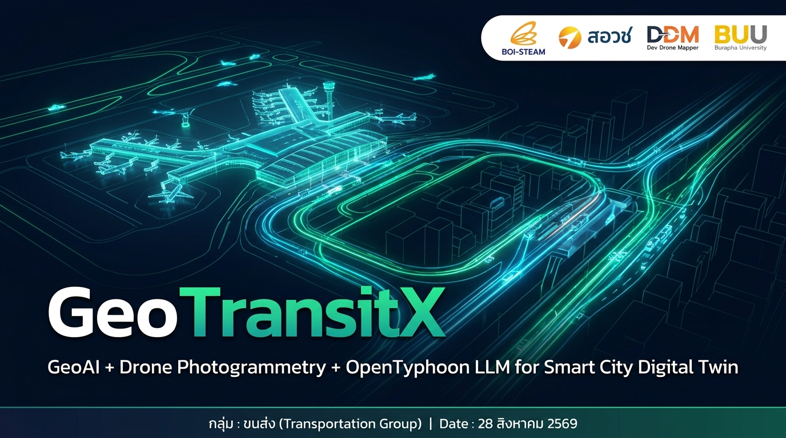
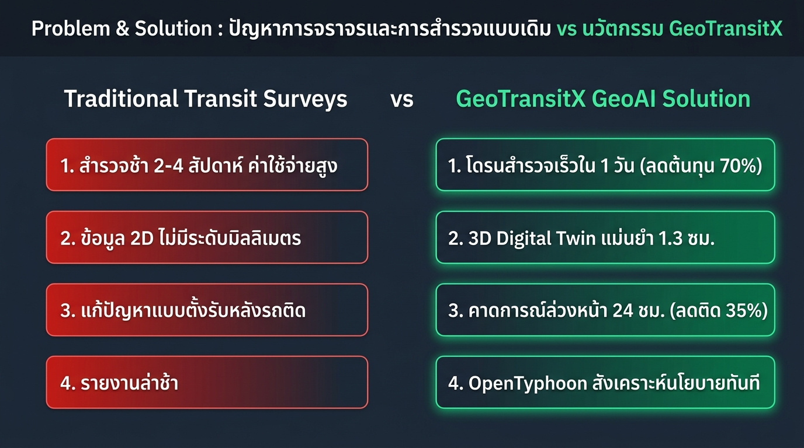
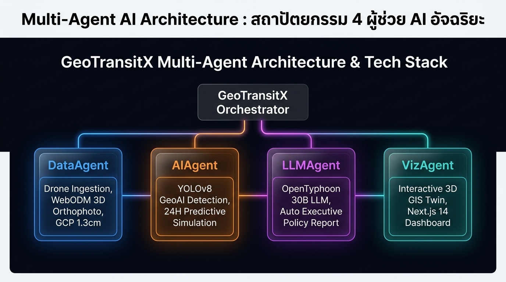
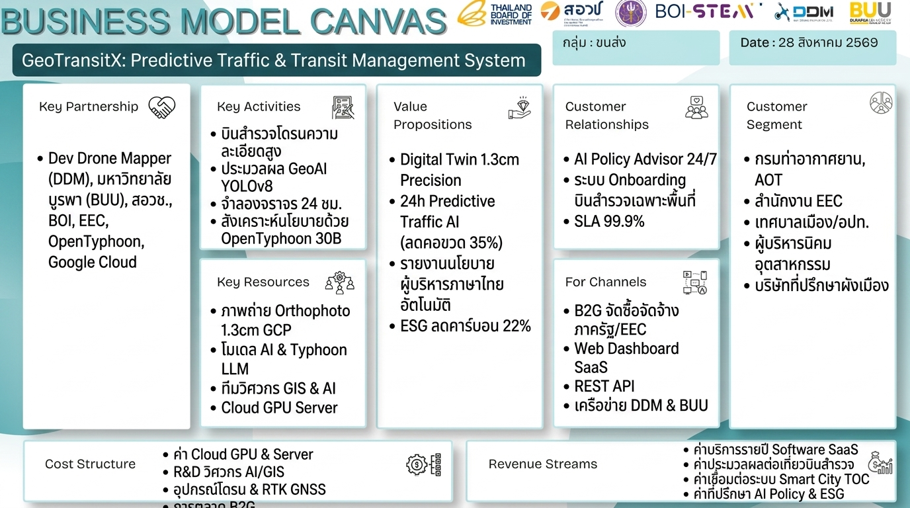
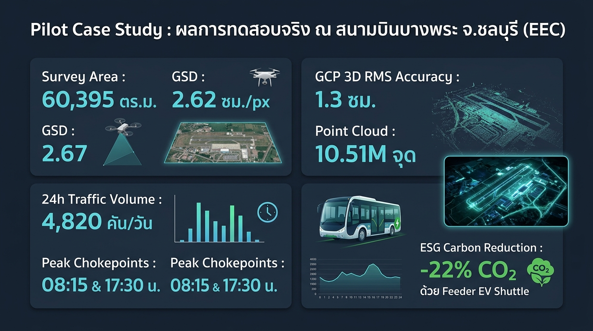
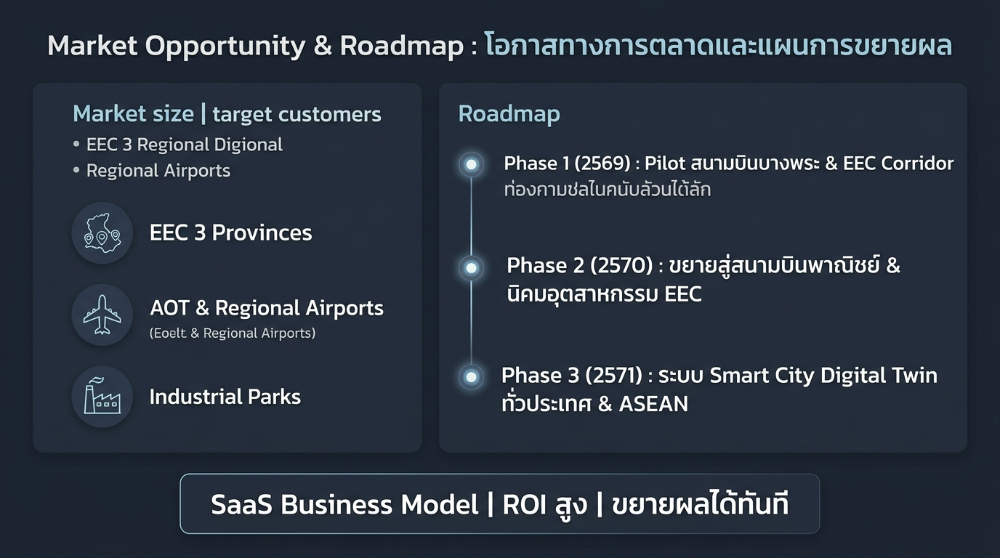

# 📊 GeoTransitX: Presentation Slide Deck & Business Model Canvas (BMC)

> **โครงการ**: GeoTransitX – Predictive Traffic & Smart Transit Management System  
> **กลุ่มอุตสาหกรรมเป้าหมาย**: กลุ่ม : ขนส่ง (Transportation Group) / เมืองอัจฉริยะ EEC  
> **วันที่มีผล**: 28 สิงหาคม 2569 (2026)  
> **ตราสัญลักษณ์ร่วมดำเนินงาน**: สำนักงานคณะกรรมการส่งเสริมการลงทุน (BOI-STEAM), สอวช., MHESI, Dev Drone Mapper Co., Ltd. (DDM), มหาวิทยาลัยบูรพา (BUU)

---

## 🖼️ แกลเลอรีสไลด์นำเสนอ 6 สไลด์ (16:9 Widescreen Presentation Slides)

### 📌 Slide 1: Title & Executive Cover (สไลด์เปิดหัวเรื่อง)
> แสดงภาพรวม 3D Digital Twin ผังสนามบินบางพระและระเบียงการเดินทาง EEC พร้อมตราสัญลักษณ์ BOI-STEAM / สอวช / DDM / BUU



* **Key Message**: GeoTransitX ผสาน GeoAI + Drone Photogrammetry + OpenTyphoon LLM เพื่อสร้าง Digital Twin คาดการณ์การจราจรและผังเมือง
* **กลุ่มนำเสนอ**: กลุ่ม : ขนส่ง (Transportation Group) | วันที่ 28 สิงหาคม 2569

---

### ⚠️ Slide 2: Problem & Solution (ปัญหาและทางออก)
> เปรียบเทียบความแตกต่างระหว่างการสำรวจแบบเดิม vs นวัตกรรม GeoTransitX



* **ปัญหาเดิม (Traditional Surveys)**:
  1. การสำรวจล่าช้า ใช้เวลานับรถ 2–4 สัปดาห์ ค่าใช้จ่ายสูงหลักแสนหลักล้าน
  2. ข้อมูลเป็นแบบ 2D ขาดความสัมพันธ์เชิงพิกัด 3 มิติระดับมิลลิเมตร
  3. การแก้ปัญหาเป็นแบบตั้งรับ (Reactive) หลังเกิดปัญหารถติดแล้ว
  4. รายงานล่าช้า ข้อมูลไม่ทันต่อการตัดสินใจเชิงนโยบาย
* **ทางออก GeoTransitX (AI Solution)**:
  1. โดรนสำรวจเร็ว ครอบคลุม 60,395 ตร.ม. ใน 1 วัน (ลดต้นทุน 70%)
  2. 3D Digital Twin ความแม่นยำสูงพิเศษ GCP RMS 1.3 ซม.
  3. คาดการณ์ล่วงหน้า 24 ชม. (ลดความล่าช้าสะสม 35%)
  4. OpenTyphoon LLM สังเคราะห์รายงานนโยบายระดับผู้บริหารทันที

---

### 🤖 Slide 3: Multi-Agent AI Architecture (สถาปัตยกรรม AI 4 ผู้ช่วย)
> โครงสร้าง Multi-Agent Orchestration ที่ทำงานประสานกันแบบ End-to-End



1. **DataAgent**: จัดการ Ingestion ข้อมูลภาพถ่ายโดรน, WebODM 3D Orthophoto (ODX v3.8.2), GCP 1.3cm Georeferencing
2. **AIAgent**: รันโมเดล YOLOv8 ตรวจจับยานพาหนะ/อากาศยาน และคำนวณแบบจำลอง Stochastic 24-Hour Simulation (LOS A–F)
3. **LLMAgent**: ขับเคลื่อนด้วย **OpenTyphoon 30B LLM** (`typhoon-v2.5-30b-a3b-instruct`) สังเคราะห์รายงานนโยบายภาษาไทยอัตโนมัติ
4. **VizAgent**: แสดงผล Interactive Leaflet 3D GIS Digital Twin และ Next.js Dashboard

---

### ⭐ Slide 4: Business Model Canvas (BMC) – กลุ่ม : ขนส่ง
> ผืนผ้าใบโมเดลธุรกิจ 9 ช่อง ครบถ้วนตามเทมเพลตมาตรฐาน BOI-STEAM / สอวช / DDM / BUU



| องค์ประกอบ BMC | รายละเอียดสำหรับ GeoTransitX |
| :--- | :--- |
| **1. Key Partnerships (พันธมิตรหลัก)** | Dev Drone Mapper (DDM), มหาวิทยาลัยบูรพา (BUU), สอวช., BOI, สำนักงาน EEC, OpenTyphoon (SCB 10X), Google Cloud (GCP) |
| **2. Key Activities (กิจกรรมหลัก)** | บินสำรวจโดรนความละเอียดสูง, ประมวลผล GeoAI YOLOv8, จำลองจราจร 24 ชม., สังเคราะห์นโยบายด้วย OpenTyphoon 30B, พัฒนา Cloud Dashboard |
| **3. Key Resources (ทรัพยากรหลัก)** | ภาพถ่าย Orthophoto 1.3cm GCP, โมเดล AI & Typhoon LLM, ทีมวิศวกร GIS & Data Scientists, Cloud GPU Server (GCP) |
| **4. Value Propositions (คุณค่าที่ส่งมอบ)** | 3D Digital Twin แม่นยำ 1.3cm, 24h Predictive Traffic AI (ลดคอขวด 35%), รายงานนโยบายผู้บริหารภาษาไทยอัตโนมัติ, ESG ลดคาร์บอน 22% |
| **5. Customer Relationships (ความสัมพันธ์กับลูกค้า)** | AI Policy Advisor 24/7, บริการ Onboarding บินสำรวจเฉพาะพื้นที่, SLA ความพร้อมใช้งาน 99.9%, อัปเดตโมเดล AI ตามรอบ |
| **6. Channels (ช่องทางเข้าถึง)** | B2G งานจัดซื้อจัดจ้างภาครัฐ/EEC, Web Dashboard SaaS, REST API สำหรับ TOC เมืองอัจฉริยะ, เครือข่าย DDM & มหาวิทยาลัยบูรพา |
| **7. Customer Segments (กลุ่มลูกค้าเป้าหมาย)** | กรมท่าอากาศยาน (DOA), AOT, สำนักงาน EEC, องค์กรปกครองส่วนท้องถิ่น (อปท./เทศบาล), ผู้บริหารนิคมอุตสาหกรรม, บริษัทที่ปรึกษาผังเมือง |
| **8. Cost Structure (โครงสร้างต้นทุน)** | ค่า Cloud GPU & Server, R&D วิศวกร AI/GIS, ค่าอุปกรณ์โดรนสำรวจ & RTK GNSS Receiver, การตลาดและสาธิต Pilot B2G |
| **9. Revenue Streams (แหล่งรายได้)** | ค่าสมาชิก Software SaaS รายปี, ค่าประมวลผลข้อมูลต่อเที่ยวบินสำรวจ, ค่าเชื่อมต่อระบบ Smart City TOC, ค่าที่ปรึกษา AI Policy & ESG |

---

### ✈️ Slide 5: Pilot Case Study – สนามบินบางพระ จ.ชลบุรี (EEC)
> ผลการทดสอบและผลลัพธ์จริงจากข้อมูลสำรวจภาคสนาม



* **Survey Area**: 60,395 ตร.ม. (GSD 2.62 ซม./px)
* **GCP 3D RMS Accuracy**: 1.3 ซม. (Point Cloud 10.51 ล้านจุด)
* **24h Traffic Volume**: 4,820 คัน/วัน
* **Peak Chokepoints**: ช่วงเช้า 08:15 น. (860 vph, LOS D) และช่วงเย็น 17:30 น. (940 vph, LOS D/E)
* **ESG Carbon Reduction**: ลดการปล่อย CO2 ได้ **22%** ด้วยระบบ Feeder EV Shuttle เชื่อมต่อสนามบิน-EEC-สุขุมวิท

---

### 📈 Slide 6: Market Opportunity & 3-Year Scaling Roadmap
> แผนการขยายผลทางธุรกิจและโอกาสทางการตลาด 3 ระยะ



* **กลุ่มเป้าหมายเชิงพื้นที่**: 3 จังหวัด EEC (ชลบุรี, ระยอง, ฉะเชิงเทรา), 6 ท่าอากาศยานหลัก AOT, 29 ท่าอากาศยานภูมิภาค, 50+ นิคมอุตสาหกรรม
* **Phase 1 (2569)**: Pilot สนามบินบางพระ & ระเบียงเศรษฐกิจพิเศษ EEC
* **Phase 2 (2570)**: ขยายสู่สนามบินพาณิชย์ & นิคมอุตสาหกรรมใน EEC
* **Phase 3 (2571)**: ระบบ Smart City Digital Twin ทั่วประเทศ & อาเซียน (ASEAN)

---

## 🎤 สคริปต์การนำเสนอ 5 นาที (5-Minute Winning Pitch Script)

```text
[0:00 - 0:45] สไลด์ 1 (Title):
"กราบเรียนท่านคณะกรรมการผู้ทรงคุณวุฒิจาก BOI, สอวช., มหาวิทยาลัยบูรพา และพันธมิตรทุกท่านครับ 
พวกเราคือทีมพัฒนา GeoTransitX: Predictive Traffic & Smart Transit Management System 
ในกลุ่มอุตสาหกรรมขนส่ง (Transportation Group) ประจำวันที่ 28 สิงหาคม 2569 ครับ"

[0:45 - 1:30] สไลด์ 2 (Problem & Solution):
"การบริหารจัดการจราจรและผังเมืองในเขต EEC ทุกวันนี้เผชิญปัญหาการสำรวจที่ช้า ใช้เวลาเป็นสัปดาห์ 
และเป็นการแก้ปัญหาแบบตั้งรับหลังจากเกิดปัญหารถติดแล้ว... GeoTransitX จึงถูกพัฒนาขึ้นเพื่อเปลี่ยน
ภาพถ่ายโดรนให้กลายเป็น 3D Digital Twin แม่นยำระดับ 1.3 ซม. และคาดการณ์คอขวดล่วงหน้า 24 ชม. 
ลดต้นทุนการสำรวจลง 70% และลดรถติดได้ 35% ครับ"

[1:30 - 2:30] สไลด์ 3 (Architecture):
"ระบบของเราขับเคลื่อนด้วย 4 Multi-Agents:
1. DataAgent จัดการข้อมูลโดรนและ WebODM 
2. AIAgent ประมวลผล YOLOv8 และ Simulation 24 ชม.
3. LLMAgent ที่ใช้ OpenTyphoon 30B สังเคราะห์รายงานเชิงนโยบายภาษาไทยอัตโนมัติ
4. VizAgent แสดงผล Digital Twin Interactive Dashboard ให้ผู้บริหารตัดสินใจได้ทันที"

[2:30 - 3:30] สไลด์ 4 (BMC Canvas):
"ในด้าน Business Model Canvas กลุ่มขนส่ง เรามีพันธมิตรที่แข็งแกร่งอย่าง Dev Drone Mapper (DDM), 
ม.บูรพา และ BOI โดยส่งมอบคุณค่า Digital Twin 1.3cm และรายงาน AI Policy ให้แก่กลุ่มลูกค้า B2G 
เช่น กรมท่าอากาศยาน, AOT, สำนักงาน EEC และนิคมอุตสาหกรรม สร้างรายได้แบบ SaaS Subscription 
และ On-Demand Processing Fee ที่คุ้มค่าการลงทุนและสร้างกระแสเงินสดต่อเนื่อง"

[3:30 - 4:15] สไลด์ 5 (Pilot Case Study):
"เราได้ทดสอบระบบจริง ณ สนามบินบางพระ จ.ชลบุรี บนพื้นที่ 60,395 ตร.ม. ได้ความแม่นยำ GCP 1.3 ซม. 
สามารถตรวจจับคอขวดวิกฤตเวลา 08:15 และ 17:30 น. พร้อมเสนอเส้นทาง Feeder EV Shuttle 
ที่ช่วยลดคาร์บอน (CO2) ได้ถึง 22% สอดคล้องกับมาตรฐาน ESG สากล"

[4:15 - 5:00] สไลด์ 6 (Roadmap & Closing):
"ด้วยโมเดลธุรกิจที่ขยายผลได้ง่าย เราวางแผนขยายสู่สนามบินพาณิชย์และนิคมฯ EEC ในปี 2570 และก้าวสู่
แพลตฟอร์ม Smart City ระดับอาเซียนในปี 2571... GeoTransitX พร้อมแล้วที่จะขับเคลื่อนเมืองอัจฉริยะ
ของประเทศไทยให้ก้าวล้ำสู่อนาคต ขอขอบคุณครับ"
```
